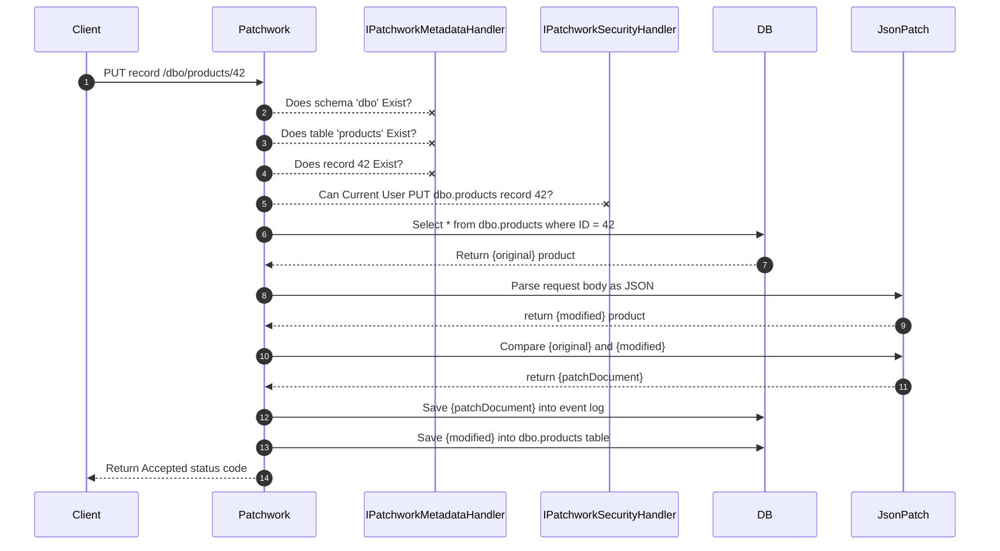

# PUT Record

The `HTTP PUT` operation is used to replace an existing database record with new values. The best use case for the PUT operation is when a caller first downloads a record with an `HTTP GET` then makes some changes to the object and they need to save those changes. The client can then use the `HTTP PUT` to send the entire object back to the server to be persisted.

The calling client will need to include a payload that has all the fields of the current record even if they have not changed. This is because on the back end, the Patchwork toolkit will assume that it should change the existing record to look just like the payload. So, if one of the fields on the payload is omitted, it will be set to `NULL` on the server.

## URL Segments

The URL for replacing a record with an `HTTP PUT` operation is as follows:

```
               The name of the server hosting the REST API.
              /         The name of the schema containing the table.
             |         /              The name of the table.
             |        |              /             The value of the primary key column from this table.
             |        |             |             /
PUT https://{server}/{schema name}/{table name}/{primary key value}
Content-Type: application/json

{ 
  // complete object in JSON format
}

```

Let's consider an example of what the Patchwork toolkit would do when this API endpoint is called. First, assume we have this table in the database.

```sql
  CREATE TABLE products (
    ID SERIAL PRIMARY KEY,
    Name VARCHAR(255) NOT NULL,
    Price NUMERIC(10, 2) NOT NULL
  );  
```

And, let's assume that this record already exists in the database.

```json
  { "ID":"42", "Name", "Widget", "Price":"42.42" }
```

When a calling the PUT endpoint with like this operation:

```http
PUT https://localhost/dbo/products/42
Content-Type: application/json

{ 
  "ID":"42", "Name", "Widget Name Here", "Price":"42.99"
}
```

Patchwork will build this query:

```sql
  UPDATE dbo.products 
  SET Name = 'Widget Name Here', Price = 42.99
  WHERE ID = 42
```

This would then result in an `HTTP 204: No Content`

## Generating a JSON-PATCH for this change
One of the unique features of the Patchwork system is that all changes are logged as events in the `Patchwork_Event_Log` table. Since a PUT operation creates a data change, the system will create a JSON-PATCH document representing that change automatically and persist it into the log automatically so we know what changes happened.

For this, Patchwork uses [JsonPatch.net](https://docs.json-everything.net/patch/basics/) to manage patch documents. The basic idea of this operation is that Patchwork will open the existing database record from before the PUT operation and create a patch document using the `CreatePatch()` method. Here is a snippet of code that shows how that would work for the example above.

```csharp
// Load the existing record as JSON before any changes.
JsonNode original = db.readJson("dbo","products","42");
// Body of PUT request
JsonNode modified = JsonNode.Parse("{'ID':'42', 'Name', 'Widget Name Here', 'Price':'42.99'}");

// create the JSON patch document
JsonPatch patch = original.CreatePatch(modified);

// write the JSON patch to the event log
db.SavePatchLogEvent("dbo","products","42", patch);
// Update the record in the products table.
db.UpdateRecord("dbo","products","42", modified);
```

## PUT Operation Sequence Diagram

Here is a sequence diagram that shows the steps that Patchwork will follow when a PUT operation is called.


