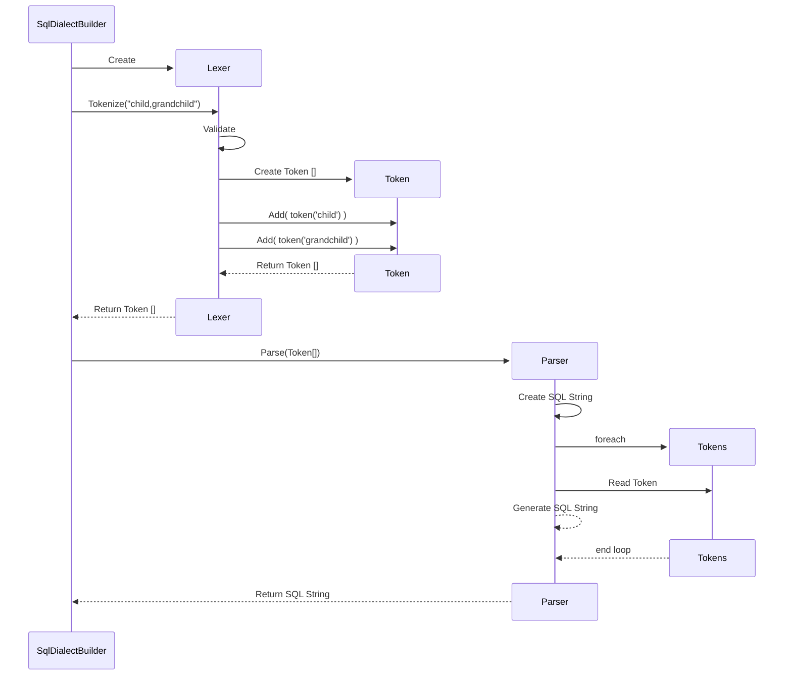

# Filter Builder Spike

The purpose of the Filter Builder Spike is to determine the feasibility of parsing the query string parameters described in our specification. This solution has a `classlib` for each query string parameter that shows how it can be parsed and validated with Unit Tests to verify correctness.

## Basic Structure of Each Parser

Each of the query string parsers follows a standard pattern to make them easy to understand and work on. The common setup means that once you understand one you will have a good understanding of all of them. The first step in parsing is to read the query string parameters. The good news is that a reliable querystring parser is already built into the ASP.net framework so we don't have to code that for ourselves.

The second step is to perform a lexical analysis of the query string parameter value and break it into logical tokens. This step is performed by a `Lexer` class. For example, the lexical analysis of the `filter=` parameter is performed by the class called `FilterLexer`.

The lexer does two important things. First, it validates that the query string parameter is valid for that type. If an `include=` parameter requests including a foreign key relationship that does not exist on that entity then the `IncludeLexer` should return an error. Or, if the `filter=` parameter has a syntax error the the `FilterLexer` should return an error. If the query string parameter is valid, then the lexer will create an array of `Token` objects to return. Each token represents a segment of the query string value that is significant. For example, `filter=name eq 'bill'` would become three `FilterToken` objects; one for the column called `name`, one for the operator `eq` and one for the string value `'bill'`. In this way, the input is fully validated and represented in an object model that is fully agnostic of the target database.

This array of tokens is the sent to a `Parser`. There is one `Parser` class for each target database. So, if the system is using Microsoft SQL Server then it would need to use the `MsSqlFilterParser` to parse an array of `FilterToken` objects while it would use `PostgreSqlFilterParser` if the application is using PostgreSql instead. The parser class will convert the array of tokens into valid database query syntax for the target database.

