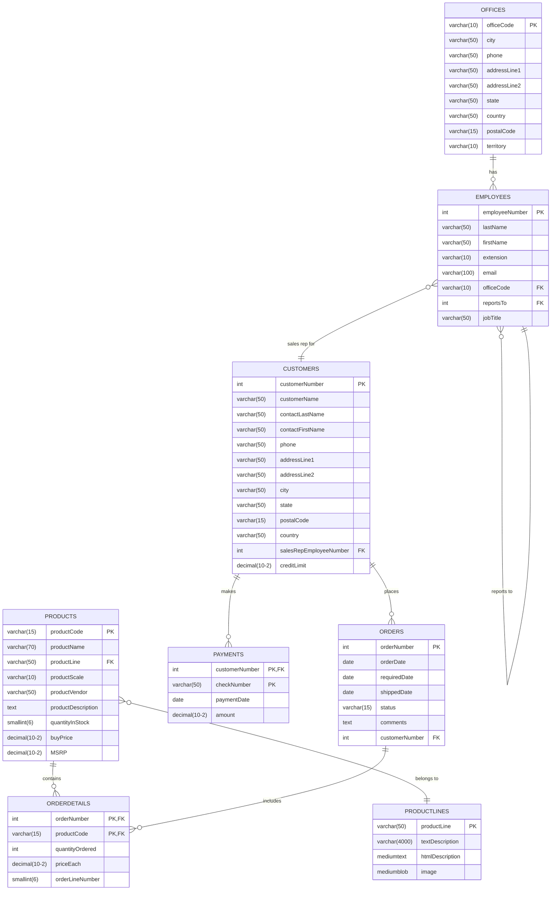

# MySQL Sample Database Schema

The MySQL sample database schema consists of the following tables:

- `customers`: stores customer’s data.
- `products`: stores a list of scale model cars.
- `productlines`: stores a list of product lines.
- `orders`: stores sales orders placed by customers.
- `orderdetails`: stores sales order line items for every sales order.
- `payments`: stores payments made by customers based on their accounts.
- `employees`: stores employee information and the organization structure such as who reports to whom.
- `offices`: stores sales office data.
  
## ER Diagram

The following picture illustrates the ER diagram of the sample database. This ER diagram is in mermaid format so we can change it if we need to make any changes to the sample database schema we are using for testing.

In addition to the ER Diagram above, the following picture illustrates the ER diagram of the same sample database as it was when we copied it from the [MySql Tutorial documentation](https://www.mysqltutorial.org/getting-started-with-mysql/mysql-sample-database/). This first image was taken from the MySQL documentation.

